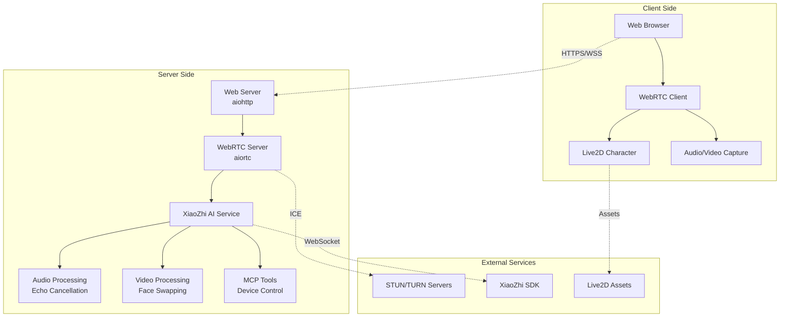

# XiaoZhi WebRTC - System Architecture

## 🏗️ High-Level Architecture



## 🔧 Core Components

### 1. **WebRTC Communication Layer**
- **Technology**: aiortc, WebRTC
- **Purpose**: Real-time audio/video communication
- **Key Features**:
  - Peer-to-peer connection establishment
  - ICE server configuration
  - Audio/video track management
  - Data channel for control messages

### 2. **AI Integration Layer**
- **Technology**: XiaoZhi SDK, WebSocket
- **Purpose**: AI-powered interaction and processing
- **Key Features**:
  - Real-time audio processing
  - Multi-modal understanding
  - MCP tool integration
  - Wake word detection

### 3. **Audio Processing Pipeline**
- **Technology**: numpy, sounddevice, opuslib
- **Purpose**: High-quality audio processing
- **Key Features**:
  - Echo cancellation
  - Audio resampling
  - Noise suppression
  - Audio format conversion

### 4. **Video Processing Pipeline**
- **Technology**: OpenCV, aiortc
- **Purpose**: Video processing and face swapping
- **Key Features**:
  - Real-time video processing
  - Face detection and swapping
  - Emoji overlay system
  - Video format conversion

### 5. **Live2D Integration**
- **Technology**: Live2D Cubism SDK, JavaScript
- **Purpose**: Character animation and interaction
- **Key Features**:
  - Character rendering
  - Animation control
  - Interactive responses
  - Asset management

## 📊 Data Flow Architecture

### Audio Flow
```
Microphone → WebRTC Audio Track → Echo Cancellation → AI Processing → Response Audio → Speaker
```

### Video Flow
```
Camera → WebRTC Video Track → Face Detection → Live2D Overlay → WebRTC Video Track → Display
```

### Control Flow
```
User Interaction → Data Channel → MCP Tools → Device Control → Response → Data Channel → UI Update
```

## 🔒 Security Architecture

### Network Security
- **HTTPS/TLS**: All client-server communication
- **WSS**: Secure WebSocket connections
- **CORS**: Cross-origin resource sharing policies
- **ICE Security**: STUN/TURN server authentication

### Data Security
- **Audio Encryption**: WebRTC built-in encryption
- **Video Encryption**: WebRTC built-in encryption
- **API Security**: Request validation and sanitization
- **Session Management**: Secure session handling

## 🚀 Performance Architecture

### Scalability
- **Horizontal Scaling**: Multiple server instances
- **Load Balancing**: Nginx/HAProxy configuration
- **Caching**: Redis for session and data caching
- **CDN**: Static asset delivery optimization

### Optimization
- **Audio Processing**: Optimized echo cancellation algorithms
- **Video Processing**: Hardware acceleration support
- **Memory Management**: Efficient buffer management
- **Connection Pooling**: WebSocket connection reuse

## 🔧 Configuration Management

### Environment Configuration
```python
# Core settings
PORT = 51000
DEFAULT_MAC_ADDR = "00:00:00:00:00:00"
OTA_URL = "wss://api.xiaozhi.dairoot.cn"

# ICE Configuration
ICE_SERVERS = [
    {"urls": "stun:stun.l.google.com:19302"},
    {"urls": "turn:your-turn-server.com:3478", "username": "user", "credential": "pass"}
]

# Audio Configuration
AUDIO_SAMPLE_RATE = 48000
AUDIO_CHANNELS = 2
AUDIO_FRAME_DURATION = 20
```

### Feature Flags
```python
# Echo Cancellation
ENABLE_ECHO_CANCELLATION = True
ENABLE_DEBUG = False

# Live2D Features
ENABLE_LIVE2D = True
ENABLE_EMOJI_OVERLAY = True

# MCP Tools
ENABLE_DEVICE_CONTROL = True
ENABLE_PHOTO_CAPTURE = True
```

## 📱 Client Architecture

### Frontend Structure
```
src/
├── index.html          # Main application page
├── chat.html           # Chat interface
├── chatv2.html         # Enhanced chat interface
├── static/
│   ├── js/             # JavaScript libraries
│   ├── hiyori_pro_zh/  # Live2D character assets
│   └── images/         # UI images and icons
```

### JavaScript Modules
- **WebRTC Client**: Connection management
- **Live2D Controller**: Character animation
- **Audio Manager**: Audio processing
- **UI Controller**: User interface management

## 🐳 Deployment Architecture

### Docker Configuration
```dockerfile
# Multi-stage build
FROM python:3.9-slim as builder
# Dependencies installation

FROM python:3.9-slim as runtime
# Application deployment
```

### Docker Compose
```yaml
services:
  xiaozhi-webrtc:
    build: .
    ports:
      - "51000:51000"
    environment:
      - PORT=51000
      - OTA_URL=wss://api.xiaozhi.dairoot.cn
```

## 📈 Monitoring & Logging

### Application Metrics
- **Connection Count**: Active WebRTC connections
- **Audio Quality**: Echo cancellation effectiveness
- **Response Time**: AI processing latency
- **Error Rates**: System error tracking

### Logging Strategy
- **Structured Logging**: JSON format for easy parsing
- **Log Levels**: DEBUG, INFO, WARNING, ERROR
- **Log Rotation**: Automated log file management
- **Centralized Logging**: ELK stack integration

## 🔄 API Architecture

### REST Endpoints
```
GET  /                    # Main application
GET  /chat               # Chat interface
GET  /chatv2             # Enhanced chat interface
GET  /api/ice            # ICE server configuration
POST /api/offer          # WebRTC offer handling
```

### WebSocket Endpoints
```
wss://api.xiaozhi.dairoot.cn  # XiaoZhi AI service
```

### Data Channel Messages
```json
{
  "type": "websocket",
  "state": "close",
  "text": "message content"
}
```

## 🎯 Future Architecture Considerations

### Microservices Migration
- **AI Service**: Separate AI processing service
- **Media Service**: Dedicated audio/video processing
- **Character Service**: Live2D character management
- **API Gateway**: Centralized API management

### Cloud-Native Features
- **Kubernetes**: Container orchestration
- **Service Mesh**: Inter-service communication
- **Auto-scaling**: Dynamic resource allocation
- **Health Checks**: Service health monitoring
