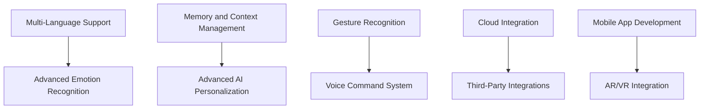

# XiaoZhi WebRTC - Feature Roadmap

## 🎯 Current State Analysis

### Existing Features
- ✅ Real-time WebRTC audio/video communication
- ✅ Live2D character integration with emotional expressions
- ✅ Advanced echo cancellation and audio processing
- ✅ MCP (Model Context Protocol) tool integration
- ✅ Touch interaction system (double tap, swipe gestures)
- ✅ Device control capabilities (volume, music, browser tabs)
- ✅ Multi-modal AI interaction (audio + visual)
- ✅ Photo capture functionality
- ✅ WebSocket-based AI communication

### Technology Stack
- **Backend**: Python 3.9+, aiohttp, aiortc
- **Frontend**: HTML5, JavaScript, Live2D Cubism SDK
- **AI Integration**: XiaoZhi SDK, WebSocket
- **Audio Processing**: numpy, sounddevice, opuslib
- **Video Processing**: OpenCV, aiortc
- **Deployment**: Docker, Docker Compose

## 🚀 Proposed Major Features

### Phase 1: Enhanced AI Capabilities (Q1 2024)

#### 1.1 Multi-Language Support
**Priority**: High
**Effort**: Medium
**Description**: Add support for multiple languages in AI conversations

**Technical Requirements**:
- Language detection and switching
- Multi-language voice synthesis
- Localized Live2D character responses
- Language-specific MCP tools

**Implementation Plan**:
- Integrate with multilingual AI models
- Add language selection UI
- Implement language-specific character animations
- Create language packs for Live2D assets

#### 1.2 Advanced Emotion Recognition
**Priority**: High
**Effort**: High
**Description**: Enhanced emotion recognition and response system

**Technical Requirements**:
- Real-time facial expression analysis
- Voice emotion detection
- Contextual emotion understanding
- Dynamic character expression mapping

**Implementation Plan**:
- Integrate emotion recognition APIs
- Enhance video processing pipeline
- Create emotion-based character animations
- Implement contextual response system

#### 1.3 Memory and Context Management
**Priority**: Medium
**Effort**: High
**Description**: Persistent memory system for conversations and user preferences

**Technical Requirements**:
- User session management
- Conversation history storage
- Preference learning system
- Context-aware responses

**Implementation Plan**:
- Design database schema for user data
- Implement session management
- Create preference learning algorithms
- Add context-aware AI responses

### Phase 2: Advanced Interaction Features (Q2 2024)

#### 2.1 Gesture Recognition System
**Priority**: High
**Effort**: High
**Description**: Advanced gesture recognition for enhanced interaction

**Technical Requirements**:
- Hand gesture detection
- Body pose estimation
- Gesture-to-action mapping
- Real-time gesture processing

**Implementation Plan**:
- Integrate MediaPipe or similar gesture recognition
- Create gesture vocabulary
- Implement gesture-to-character-action mapping
- Add gesture learning capabilities

#### 2.2 Voice Command System
**Priority**: High
**Effort**: Medium
**Description**: Comprehensive voice command system

**Technical Requirements**:
- Natural language command processing
- Command execution pipeline
- Voice feedback system
- Command learning and adaptation

**Implementation Plan**:
- Expand MCP tool vocabulary
- Implement command parsing
- Add voice confirmation system
- Create command help system

#### 2.3 Multi-User Support
**Priority**: Medium
**Effort**: High
**Description**: Support for multiple users in the same session

**Technical Requirements**:
- User identification and management
- Multi-user WebRTC connections
- User-specific character interactions
- Session management for multiple users

**Implementation Plan**:
- Design multi-user architecture
- Implement user management system
- Create user-specific character instances
- Add multi-user session controls

### Phase 3: Platform Integration (Q3 2024)

#### 3.1 Mobile App Development
**Priority**: High
**Effort**: High
**Description**: Native mobile applications for iOS and Android

**Technical Requirements**:
- React Native or Flutter development
- Mobile-optimized WebRTC implementation
- Touch gesture handling
- Mobile-specific UI/UX

**Implementation Plan**:
- Choose mobile development framework
- Port WebRTC functionality
- Create mobile-specific UI components
- Implement mobile gesture recognition

#### 3.2 Cloud Integration
**Priority**: Medium
**Effort**: High
**Description**: Cloud-based services and data synchronization

**Technical Requirements**:
- Cloud storage for user data
- Cross-device synchronization
- Cloud-based AI processing
- Scalable infrastructure

**Implementation Plan**:
- Design cloud architecture
- Implement data synchronization
- Create cloud-based AI services
- Add cross-device support

#### 3.3 Third-Party Integrations
**Priority**: Medium
**Effort**: Medium
**Description**: Integration with popular platforms and services

**Technical Requirements**:
- Social media integration
- Calendar and productivity apps
- Smart home device control
- Music and media services

**Implementation Plan**:
- Create integration framework
- Implement OAuth authentication
- Add platform-specific APIs
- Create unified control interface

### Phase 4: Advanced AI Features (Q4 2024)

#### 4.1 Custom Character Creation
**Priority**: High
**Effort**: High
**Description**: User-created custom Live2D characters

**Technical Requirements**:
- Character creation tools
- Asset management system
- Character sharing platform
- Custom animation system

**Implementation Plan**:
- Create character editor
- Implement asset pipeline
- Build character marketplace
- Add custom animation support

#### 4.2 Advanced AI Personalization
**Priority**: High
**Effort**: High
**Description**: Deep personalization based on user behavior and preferences

**Technical Requirements**:
- Machine learning for user behavior
- Personalized response generation
- Adaptive character behavior
- Learning from user interactions

**Implementation Plan**:
- Implement ML models for personalization
- Create behavior analysis system
- Add adaptive response generation
- Build learning feedback loops

#### 4.3 AR/VR Integration
**Priority**: Low
**Effort**: Very High
**Description**: Augmented and Virtual Reality support

**Technical Requirements**:
- AR/VR SDK integration
- 3D character rendering
- Spatial audio processing
- Hand tracking and interaction

**Implementation Plan**:
- Research AR/VR technologies
- Create 3D character models
- Implement spatial audio
- Add hand tracking support

## 📊 Feature Prioritization Matrix

### High Priority Features
1. **Multi-Language Support** - High impact, medium effort
2. **Advanced Emotion Recognition** - High impact, high effort
3. **Gesture Recognition System** - High impact, high effort
4. **Voice Command System** - High impact, medium effort
5. **Mobile App Development** - High impact, high effort
6. **Custom Character Creation** - High impact, high effort
7. **Advanced AI Personalization** - High impact, high effort

### Medium Priority Features
1. **Memory and Context Management** - Medium impact, high effort
2. **Multi-User Support** - Medium impact, high effort
3. **Cloud Integration** - Medium impact, high effort
4. **Third-Party Integrations** - Medium impact, medium effort

### Low Priority Features
1. **AR/VR Integration** - High impact, very high effort

## 🎯 Implementation Strategy

### Sprint Planning
- **Sprint Duration**: 2 weeks
- **Team Size**: 8 members (as defined in agile team structure)
- **Sprint Capacity**: 80 story points per sprint

### Feature Dependencies

### Resource Requirements

#### Development Team
- **Backend Developers**: 2-3 developers
- **Frontend Developers**: 2-3 developers
- **AI/ML Engineers**: 1-2 engineers
- **DevOps Engineers**: 1 engineer
- **QA Engineers**: 1-2 engineers

#### Infrastructure
- **Cloud Services**: AWS/Azure/GCP
- **AI Services**: OpenAI, Google AI, or similar
- **CDN**: CloudFlare or similar
- **Database**: PostgreSQL or MongoDB
- **Message Queue**: Redis or RabbitMQ

#### Budget Estimates
- **Development**: $200,000 - $400,000 per quarter
- **Infrastructure**: $5,000 - $15,000 per month
- **Third-party Services**: $2,000 - $10,000 per month
- **Total Annual Budget**: $1,000,000 - $2,000,000

## 📈 Success Metrics

### User Engagement
- **Daily Active Users (DAU)**: Target 10,000+ by end of 2024
- **Session Duration**: Average 30+ minutes per session
- **User Retention**: 70%+ monthly retention rate
- **Feature Adoption**: 80%+ adoption rate for new features

### Technical Performance
- **Response Time**: < 100ms for AI responses
- **Uptime**: 99.9%+ availability
- **Audio Quality**: < 50ms latency
- **Video Quality**: 30+ FPS with 720p resolution

### Business Metrics
- **User Growth**: 50%+ month-over-month growth
- **Revenue**: $100,000+ monthly recurring revenue
- **Customer Satisfaction**: 4.5+ star rating
- **Market Share**: Top 3 in AI companion category

## 🔄 Continuous Improvement

### Feedback Loops
- **User Feedback**: Weekly user surveys and feedback collection
- **Analytics**: Real-time usage analytics and performance monitoring
- **A/B Testing**: Continuous testing of new features and improvements
- **Community Input**: Regular community discussions and feature requests

### Iteration Cycles
- **Feature Releases**: Monthly feature releases
- **Bug Fixes**: Weekly bug fix releases
- **Performance Updates**: Bi-weekly performance optimizations
- **Security Updates**: Immediate security patch releases

### Quality Assurance
- **Automated Testing**: 90%+ code coverage
- **Manual Testing**: Comprehensive manual testing for each release
- **Performance Testing**: Load testing and stress testing
- **Security Audits**: Quarterly security audits and penetration testing
